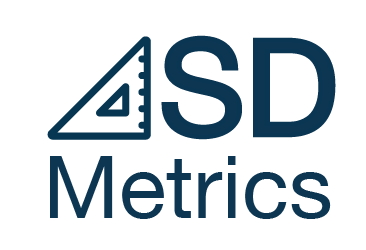
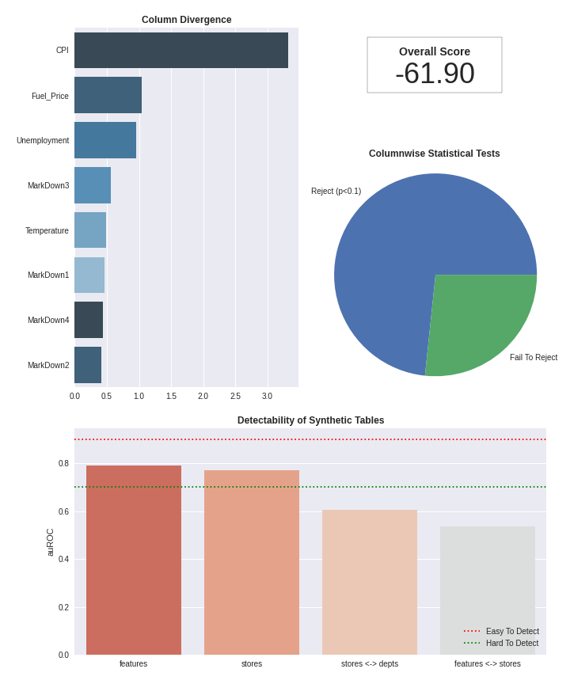

<p align="left">

<i>An open source project from Data to AI Lab at MIT.</i>
</p>

[](https://pypi.org/search/?c=Development+Status+%3A%3A+2+-+Pre-Alpha)
[](https://pypi.python.org/pypi/sdmetrics)
[](https://pepy.tech/project/sdmetrics)
[](https://github.com/sdv-dev/SDMetrics/actions?query=workflow%3A%22Run+Tests%22+branch%3Amaster)
[](https://codecov.io/gh/sdv-dev/SDMetrics)

<p>
  
</p>

Metrics for Synthetic Data Generation Projects

* License: [MIT](https://github.com/sdv-dev/SDMetrics/blob/master/LICENSE)
* Development Status: [Pre-Alpha](https://pypi.org/search/?c=Development+Status+%3A%3A+2+-+Pre-Alpha)
* Documentation: https://sdv-dev.github.io/SDMetrics
* Homepage: https://github.com/sdv-dev/SDMetrics

# Overview

The **SDMetrics** library provides a set of **dataset-agnostic tools** for evaluating the **quality of a synthetic database** by comparing it to the real database that it is modeled after. It includes a variety of metrics such as:

 - **Statistical metrics** which use statistical tests to compare the distributions of the real and synthetic distributions.
 - **Detection metrics** which use machine learning to try to distinguish between real and synthetic data.
 - **Descriptive metrics** which compute descriptive statistics on the real and synthetic datasets independently and then compare the values.

# Install

## Requirements

**SDMetrics** has been developed and tested on [Python 3.6, 3.7 and 3.8](https://www.python.org/downloads/)

Also, although it is not strictly required, the usage of a [virtualenv](
https://virtualenv.pypa.io/en/latest/) is highly recommended in order to avoid
interfering with other software installed in the system where **SDMetrics** is run.

## Install with pip

The easiest and recommended way to install **SDMetrics** is using [pip](
https://pip.pypa.io/en/stable/):

```bash
pip install sdmetrics
```

This will pull and install the latest stable release from [PyPi](https://pypi.org/).

If you want to install from source or contribute to the project please read the
[Contributing Guide](https://sdv-dev.github.io/SDMetrics/contributing.html#get-started).

# Basic Usage

Let's run the demo code from **SDV** to generate a simple synthetic dataset:

```python3
from sdv import load_demo, SDV

metadata, real_tables = load_demo(metadata=True)

sdv = SDV()
sdv.fit(metadata, real_tables)

synthetic_tables = sdv.sample_all(20)
```

Now that we have a synthetic dataset, we can evaluate it using **SDMetrics** by calling the `evaluate` function which returns an instance of `MetricsReport` with the default metrics:

```python3
from sdmetrics import evaluate

report = evaluate(metadata, real_tables, synthetic_tables)
```

## Examining Metrics

This `report` object makes it easy to examine the metrics at different levels of granularity. For example, the `overall` method returns a single scalar value which functions as a composite score combining all of the metrics. This score can be passed to an optimization routine (i.e. to tune the hyperparameters in a model) and minimized in order to obtain higher quality synthetic data.

```python3
print(report.overall())
```

In addition, the `report` provides a `highlights` method which identifies the worst performing metrics. This provides useful hints to help users identify where their synthetic data falls short (i.e. which tables/columns/relationships are not being modeled properly).

```python3
print(report.highlights())
```

## Visualizing Metrics

Finally, the `report` object provides a `visualize` method which generates a figure showing some of the key metrics.

```python3
figure = report.visualize()
figure.savefig("sdmetrics-report.png")
```

<p align="center">
    
</p>

# Advanced Usage

## Specifying Metrics

Instead of running all the default metrics, you can specify exactly what metrics you
want to run by creating an empty `MetricsReport` and adding the metrics yourself. For
example, the following code only computes the machine learning detection-based metrics.

The `MetricsReport` object includes a `details` method which returns all of the
metrics that were computed.

```python3
from sdmetrics import detection
from sdmetrics.report import MetricsReport

report = MetricsReport()
report.add_metrics(detection.metrics(metadata, real_tables, synthetic_tables))
```

## Creating Metrics

Suppose you want to add some new metrics to this library. To do this, you simply
need to write a function which yields instances of the `Metric` object:

```python3
from sdmetrics.report import Metric

def my_custom_metrics(metadata, real_tables, synthetic_tables):
    name = "abs-diff-in-number-of-rows"

    for table_name in metadata.get_tables():

        # Absolute difference in number of rows
        nb_real_rows = len(real_tables[table_name])
        nb_synthetic_rows = len(synthetic_tables[table_name])
        value = float(abs(nb_real_rows - nb_synthetic_rows))

        # Specify some useful tags for the user
        tags = set([
            "priority:high",
            "table:%s" % table_name
        ])

        yield Metric(name, value, tags)
```

To attach your metrics to a `MetricsReport` object, you can use the `add_metrics`
method and provide your custom metrics iterator:

```python3
from sdmetrics.report import MetricsReport

report = MetricsReport()
report.add_metrics(my_custom_metrics(metadata, real_tables, synthetic_tables))
```

See `sdmetrics.detection`, `sdmetrics.efficacy`, and `sdmetrics.statistical` for
more examples of how to implement metrics.

## Filtering Metrics

The `MetricsReport` object includes a `details` method which returns all of the
metrics that were computed.

```python3
from sdmetrics.report import MetricsReport

report = evaluate(metadata, real_tables, synthetic_tables)
report.details()
```

To filter these metrics, you can provide a filter function. For example, to only
see metrics that are associated with the `users` table, you can run

```python3
def my_custom_filter(metric):
  if "table:users" in metric.tags:
    return True
  return False

report.details(my_custom_filter)
```

Examples of standard tags implemented by the built-in metrics are shown below.

<table>
  <tr>
    <th style="width:14em;">Tag</th>
    <th>Description</th>
  </tr>
  <tr>
    <td><code>priority:high</code></td>
    <td>This tag tells the user to pay extra attention to this metric. It typically indicates that the objects being evaluated by the metric are unusually bad (i.e. the synthetic values look very different from the real values).</td>
  </tr>
  <tr>
    <td><code>table:TABLE_NAME</code></td>
    <td>This tag indicates that the metric involves the table specified by <code>TABLE_NAME</code>.
  </tr>
  <tr>
    <td><code>column:COL_NAME</code></td>
    <td>This tag indicates that the metric involves the column specified by <code>COL_NAME</code>. If the column names are not unique across the entire database, then it needs to be combined with the <code>table:TABLE_NAME</code> tag to uniquely identify a specific column.</td>
  </tr>
</table>

As this library matures, we will define additional standard tags and/or promote them to
first class attributes.

# What's next?

For more details about **SDMetrics** and all its possibilities and features, please check
the [documentation site](https://sdv-dev.github.io/SDMetrics/).
