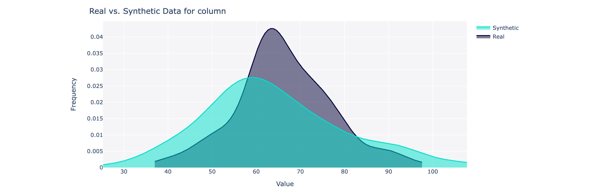
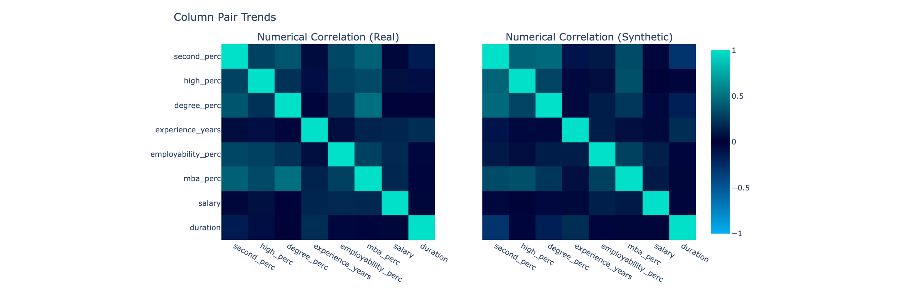

<div align="center">
<br/>
<p align="center">
    <i>This repository is part of <a href="https://sdv.dev">The Synthetic Data Vault Project</a>, a project from <a href="https://datacebo.com">DataCebo</a>.</i>
</p>

[](https://pypi.org/search/?c=Development+Status+%3A%3A+2+-+Pre-Alpha)
[](https://pypi.python.org/pypi/sdmetrics)
[](https://pepy.tech/project/sdmetrics)
[](https://github.com/sdv-dev/SDMetrics/actions?query=workflow%3A%22Run+Tests%22+branch%3Amaster)
[](https://codecov.io/gh/sdv-dev/SDMetrics)
[](https://bit.ly/sdv-slack-invite)
[](https://bit.ly/sdmetrics-demo)

<div align="left">
<br/>
<p align="center">
<a href="https://github.com/sdv-dev/SDV">
</img>
</a>
</p>
</div>

</div>

# Overview

The SDMetrics library evaluates synthetic data by comparing it to the real data that you're trying to mimic. It includes a variety of metrics to capture different aspects of the data, for example **quality and privacy**. It also includes reports that you can run to generate insights, visualize data and share with your team.

The SDMetrics library is **model-agnostic**, meaning you can use any synthetic data. The library does not need to know how you created the data. 

</img>

# Install

Install SDMetrics using pip or conda. We recommend using a virtual environment to avoid conflicts with other software on your device.

```bash
pip install sdmetrics
```

```bash
conda install -c conda-forge sdmetrics
```

For more information about using SDMetrics, visit the [SDMetrics Documentation](https://docs.sdv.dev/sdmetrics).

# Usage

Get started with **SDMetrics Reports** using some demo data,

```python
from sdmetrics import load_demo
from sdmetrics.reports.single_table import QualityReport

real_data, synthetic_data, metadata = load_demo(modality='single_table')

my_report = QualityReport()
my_report.generate(real_data, synthetic_data, metadata)
```
```
Creating report: 100%|██████████| 4/4 [00:00<00:00,  5.22it/s]

Overall Quality Score: 82.84%

Properties:
Column Shapes: 82.78%
Column Pair Trends: 82.9%
```

Once you generate the report, you can drill down on the details and visualize the results.

```python
my_report.get_visualization(property_name='Column Pair Trends')
```
</img>

Save the report and share it with your team.
```python
my_report.save(filepath='demo_data_quality_report.pkl')

# load it at any point in the future
my_report = QualityReport.load(filepath='demo_data_quality_report.pkl')
```

**Want more metrics?** You can also manually apply any of the metrics in this library to your data.

```python
# calculate whether the synthetic data respects the min/max bounds
# set by the real data
from sdmetrics.single_column import BoundaryAdherence

BoundaryAdherence.compute(
    real_data['start_date'],
    synthetic_data['start_date']
)
```
```
0.8503937007874016
```

```python
# calculate whether the synthetic data is new or whether it's an exact copy of the real data
from sdmetrics.single_table import NewRowSynthesis

NewRowSynthesis.compute(
    real_data,
    synthetic_data,
    metadata
)
```
```
1.0
```

# What's next?

To learn more about the reports and metrics, visit the [SDMetrics Documentation](https://docs.sdv.dev/sdmetrics). 

---


<div align="center">
<a href="https://datacebo.com"></img></a>
</div>
<br/>
<br/>

[The Synthetic Data Vault Project](https://sdv.dev) was first created at MIT's [Data to AI Lab](
https://dai.lids.mit.edu/) in 2016. After 4 years of research and traction with enterprise, we
created [DataCebo](https://datacebo.com) in 2020 with the goal of growing the project.
Today, DataCebo is the proud developer of SDV, the largest ecosystem for
synthetic data generation & evaluation. It is home to multiple libraries that support synthetic
data, including:

* 🔄 Data discovery & transformation. Reverse the transforms to reproduce realistic data.
* 🧠 Multiple machine learning models -- ranging from Copulas to Deep Learning -- to create tabular,
  multi table and time series data.
* 📊 Measuring quality and privacy of synthetic data, and comparing different synthetic data
  generation models.

[Get started using the SDV package](https://sdv.dev/SDV/getting_started/install.html) -- a fully
integrated solution and your one-stop shop for synthetic data. Or, use the standalone libraries
for specific needs.
